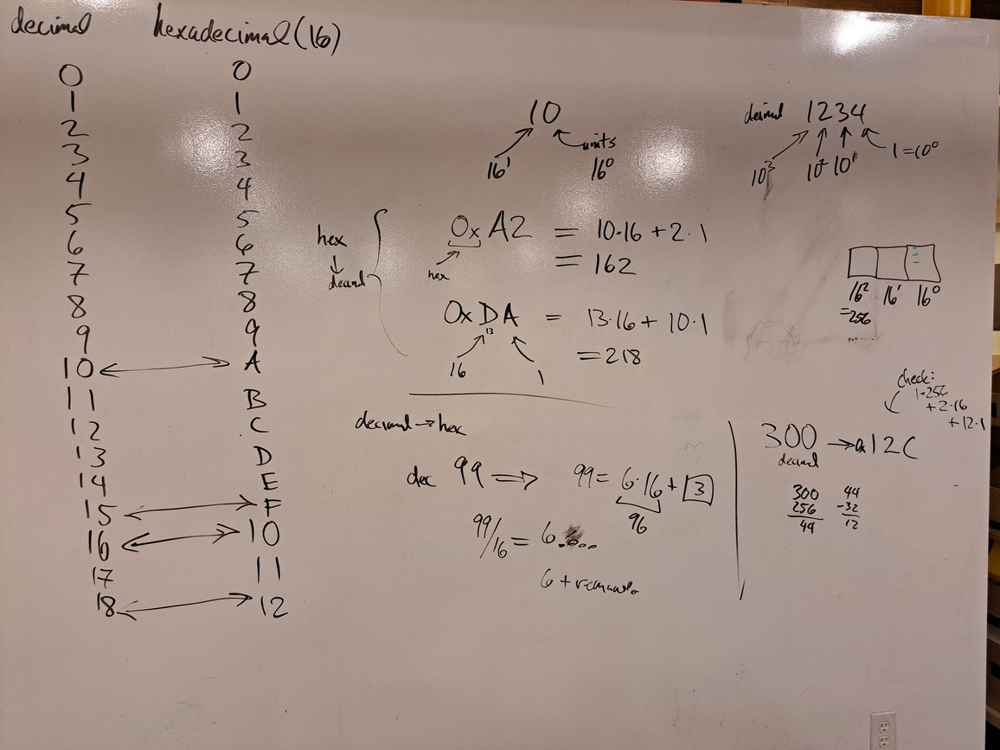
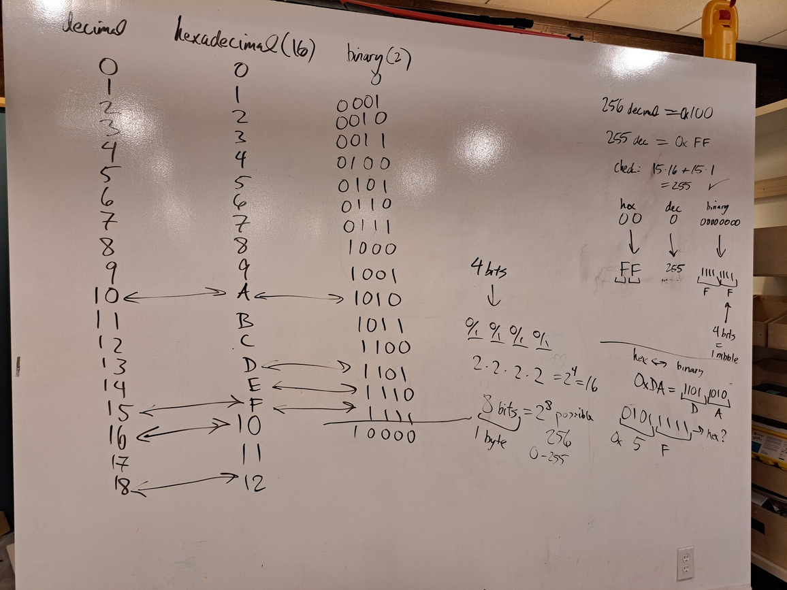
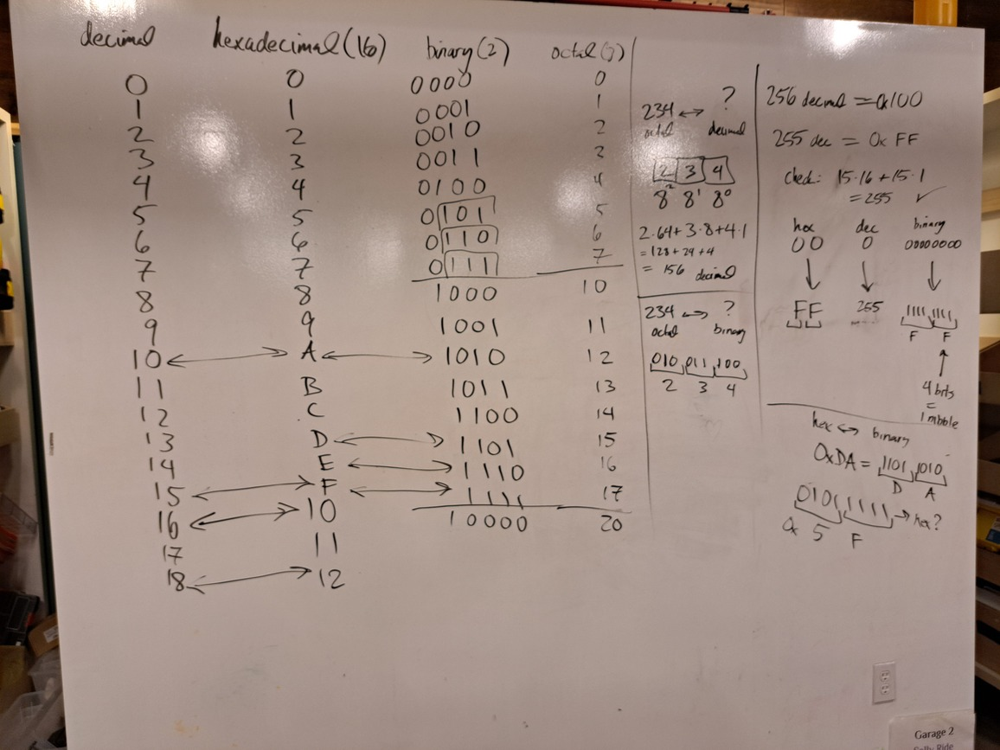

# Unit 0: Numeric Conversion

## Counting in binary

* decimal
* binary
* hexadecimal
* octal

## Notes (exploratory)

In decimal (base 10) we have:

$$
\begin{aligned}
     1234 &=  \underbrace{\fbox{1}}_{10^3}\underbrace{\fbox{2}}_{10^2}\underbrace{\fbox{3}}_{10^1}\underbrace{\fbox{4}}_{10^0} \\
     &= 1 \cdot 10^3 + 2 \cdot 10^2 + 3 \cdot 10^1 + 4 \cdot 10^0 \\
     &= 1000 + 200 + 3 + 4
\end{aligned}
$$

Hexadecimal is base 16, so we have:

$$
\begin{aligned}
     \text{0x10} &=  \underbrace{\fbox{1}}_{16^1}\underbrace{\fbox{0}}_{16^0} \\
      &= 1 \cdot 16^1 + 0 \cdot 16^0  \\
      &= 1 \cdot 16 + 0 \cdot 1  \\
      &= 16 \, \text{(decimal)}
\end{aligned}
$$

$$
\begin{array}{|c|c|}
    \hline 
    \text{decimal} & \text{hexadecimal} \\
    \hline 
    0 & 0 \\
    1 & 1 \\
    2 & 2 \\
    3 & 3 \\
    4 & 4 \\
    5 & 5 \\
    6 & 6 \\
    7 & 7 \\
    8 & 8 \\
    9 & 9 \\
    10 & A \\
    11 & B \\
    12 & C \\
    13 & D \\
    14 & E \\
    15 & F \\
    16 & 10 \\
    17 & 11 \\
    18 & 12 \\
    \cdots & \cdots \\
    \hline 
\end{array}
$$
