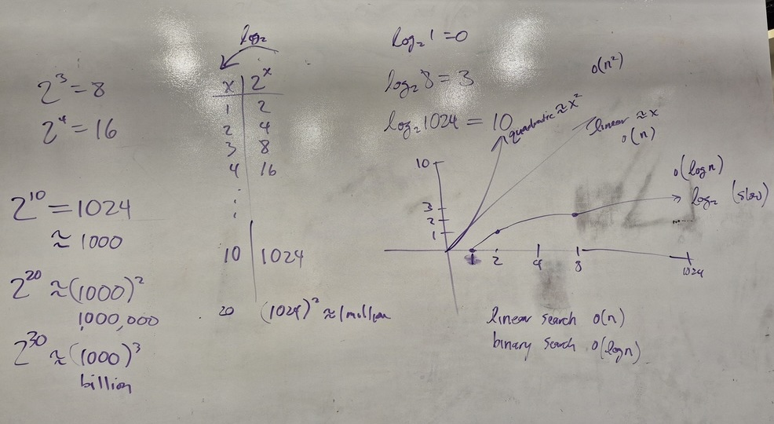
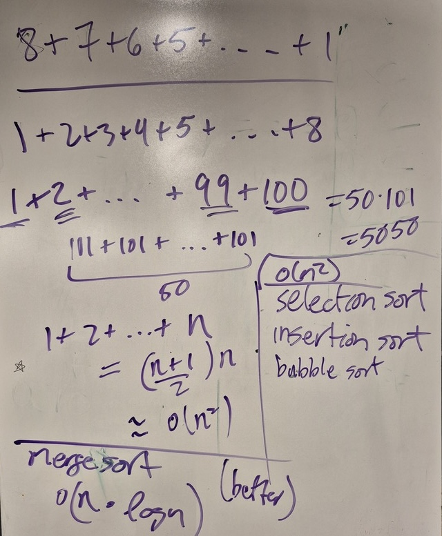

# Unit 14 - Algorithms

## Topics

- algorithm analysis

- searching
    - linear search
    - binary search
    - $o(n)$ vs. $o(\log n)$ 

- sorting
    - insertion sort
    - selection sort
    - bubble sort
    - merge sort
    - $o(n^2)$ vs. $o(n \log n)$

## Links

[Sorting animations](https://visualgo.net/en/sorting)

## Class Notes

