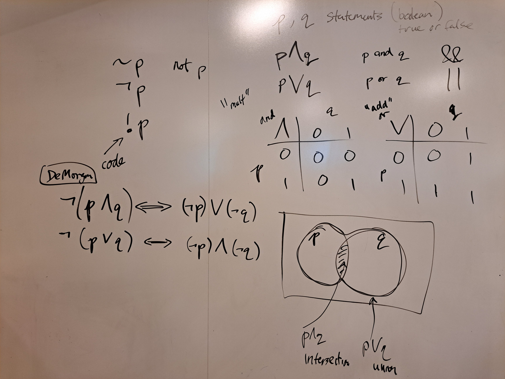

# Unit 2 - Functions and Testing

## Topics

- (static) functions: arguments, return types

- conditions and logical operators
    - relational operators `==`, `<`, etc.
    - logical operators: `&&`, `||`, `!`

- truth tables: and, or, not

- logic and set theory

- De Morgan's Laws

- unit testing

[http://codingbat.com/java/Warmup-1](http://codingbat.com/java/Warmup-1)

## Logical operators

Let $p$ and $q$ be Boolean statements (they are either true
or false).  The logical operators (_and_, _or_, _not_) act
on $p$ and $q$ and return a Boolean value.

$$
\begin{array}{|c|c|c|}
    \hline 
    \text{English} & \text{Set Theory} & \text{Logic} & \text{Java} \\
    \hline 
    p \text{ and } q & p \cap q & p \wedge q & p \text{ && } q \\
    \hline 
    p \text{ or } q & p \cup q & p \vee q & p \text{ || } q \\
    \hline 
    \text{ not } p & X\setminus \, p & \neg p & \text{!} p \\
    \hline 
\end{array}
$$

Intuitively, you can think of the logical _and_ as
corresponding to the set theoretic _intersection_, and the
logical _or_ as _union_.  In more detail, thinking of $p$
and $q$ as sets, we have:

$$
x \in \, p \cap q \quad \iff \quad x \in \, p \text{  and  } p \in \, q
$$

$$
x \in \, p \cup q \quad \iff \quad x \in \, p \text{  or  } p \in \, q
$$

Similarly, you can think of the logical _not_ as _set complement_.  

TODO: venn diagram here

## Truth tables

We can construct truth tables for the logical operators, 
where 0 == false and 1 == true.

_and_

$$
\begin{array}{|c|cc|}
    \hline 
    \wedge & \text{0} & \text{1} \\
    \hline 
    0 & 0 & 0\\
    1 & 0 & 1\\
    \hline 
\end{array}
$$

_or_

$$
\begin{array}{|c|cc|}
    \hline 
    \vee & \text{0} & \text{1} \\
    \hline 
    0 & 0 & 1\\
    1 & 1 & 1\\
    \hline 
\end{array}
$$

Observe that the _and_ operator looks like multiplication and the
_or_ operator looks (almost) like addition.  In Java (and other
programming languages), the logical operators follow analagous
precedence rules to the arithmetic operators, i.e. `&&`
has higher precedence than `||`, just as multiplication has
higher precedance than addition.

## De Morgan's Laws

De Morgan's Laws can be thought of as distributive laws for
the logical operators. 

$$
\neg (p \cap q) \iff (\neg p) \cup (\neg q)
$$

$$
\neg (p \cup q) \iff (\neg p) \cap (\neg q)
$$

In words, you can distribute the _not_ operator over _and_/_or_,
but you need to flip the _and_/_or_.

Here's an example:  Let $p$ be the statement "I got an A in
Math", and $q$ be the statement "I got an A in Physics".  If it
is not true that "I got an A in Math and I got an A in Physics"
($\neg (p \cap q)$, this means that either I didn't get an A in
Math $(\neg p)$ or I didn't get an A in Physics $(\neg q)$.

## Original &notes

## Demo

- <a href="../unit2_demo/Functions.java">Functions.java</a>
- <a href="../unit2_demo/MonkeyTrouble.java">MonkeyTrouble.java</a>

