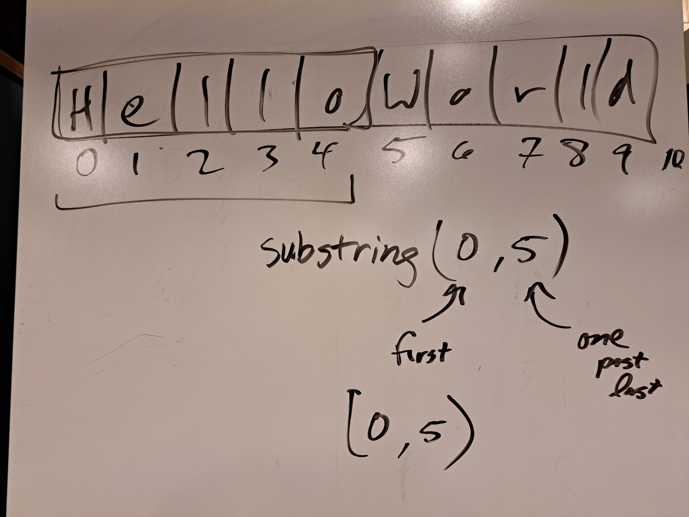
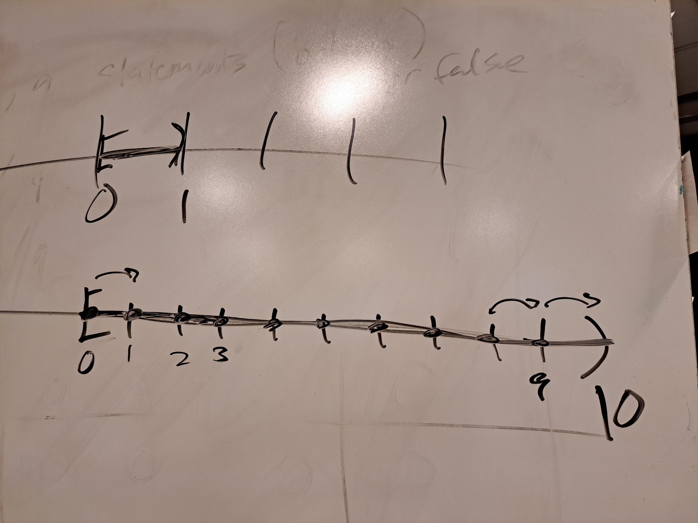
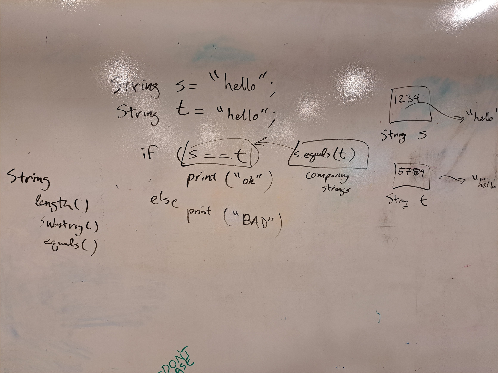

# Unit 3 - String, Math

Topics:

- class `Math`
    - `PI`, `E`
    - `sin()`, `cos()`, `exp()`
    - `random()`
    - `abs()`, floating point equality comparisons

- class `String`
    - String objects and return values
    - concatenation
    - reference types, comparison, `equals()` 
    - `length()`, `substring()`

## Strings

$$
\underset{0}{\fbox{ H }}
\underset{1}{\fbox{ e }}
\underset{2}{\fbox{ l }}
\underset{3}{\fbox{ l }}
\underset{4}{\fbox{ o }}
\underset{5}{\fbox{ , }}
$$

## Original notes

## Demo

- <a href="../unit3_demo/HelloStrings.java">HelloStrings.java</a>
- <a href="../unit3_demo/HelloMath.java">HelloMath.java</a>
- <a href="../unit3_demo/HelloRandom.java">HelloRandom.java</a>

