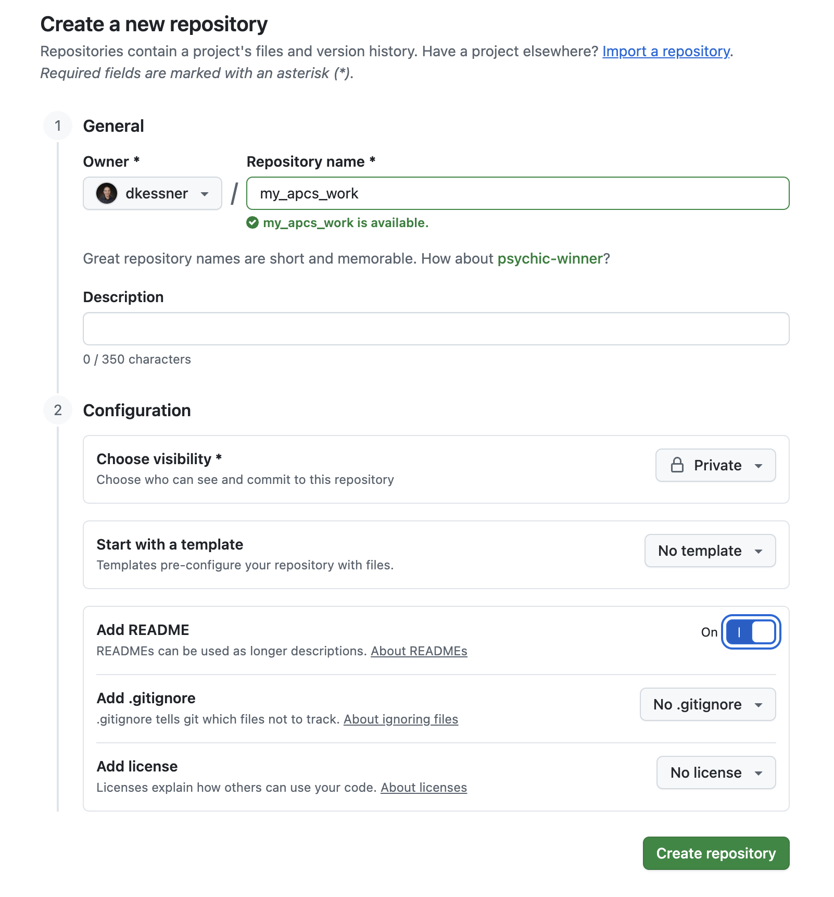
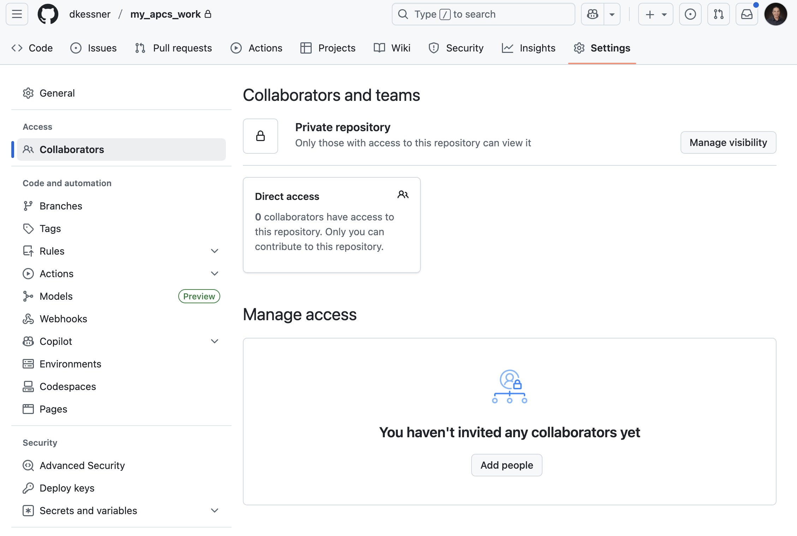
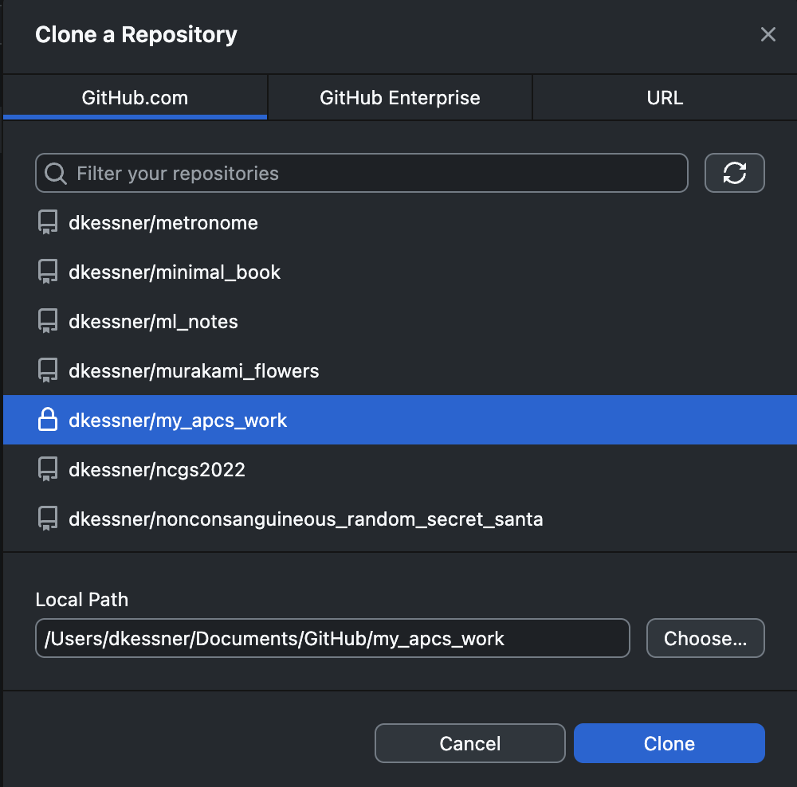
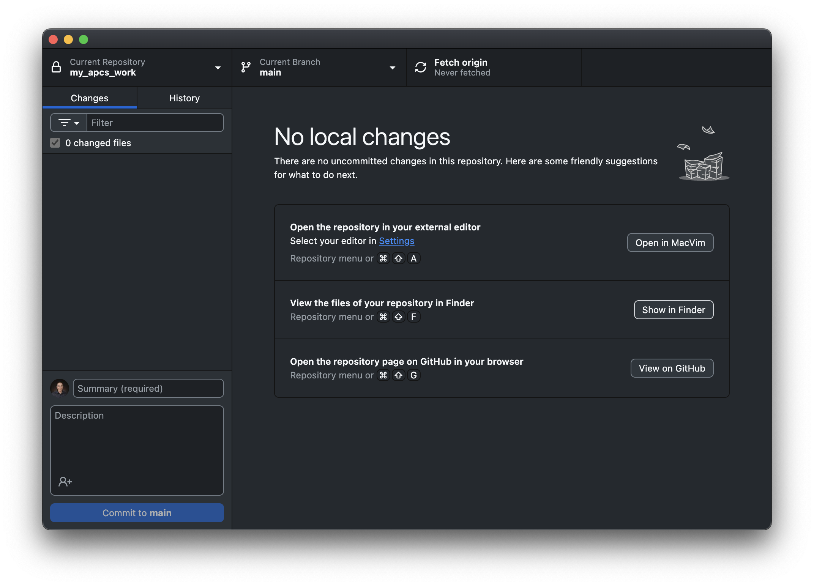
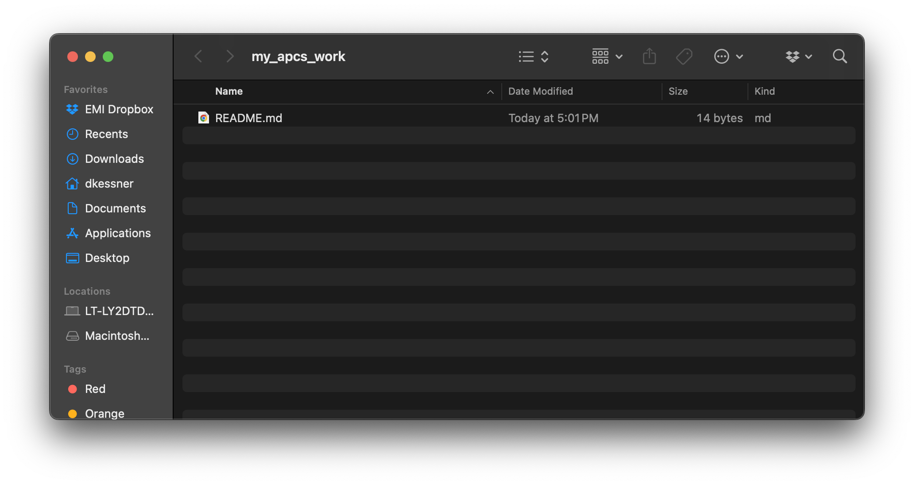

# GitHub Repository Setup

## 1. Create a new repository on GitHub

    a. Open GitHub.com in your browser and log in.
    b. Go to Repositories tab / click `New`
    c. Specify a name like "my_apcs_work".  Select "Add README".  
        Click `Create repository`

## 2. Add me (dkessner) as a collaborator.

    a. Navigate to Settings / Collaborators on your repository page.

    b. Click `Add people`, and add `dkessner` as a collaborator

## 3. Clone the repository in GitHub Desktop

    a. Open GitHub Desktop
    b. Make sure you're logged in with your GitHub account.
    c. Find and clone your repository.

## 4. Check that you can see your repository on your computer

    Click `Show in Finder` to see the folder.

